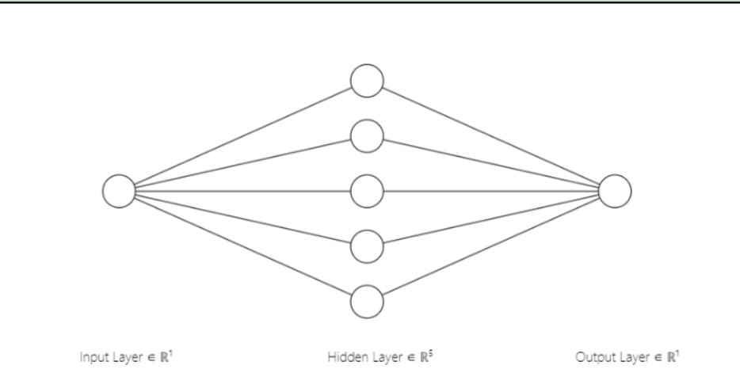
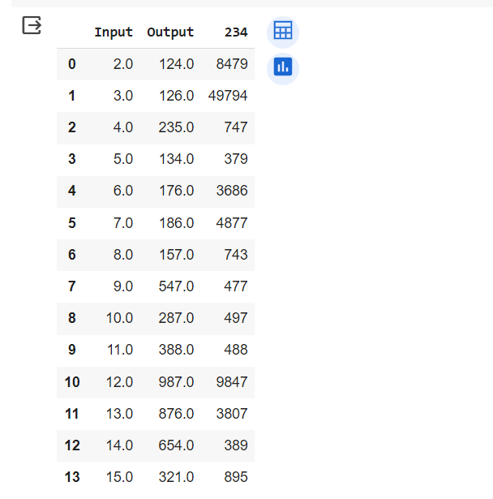
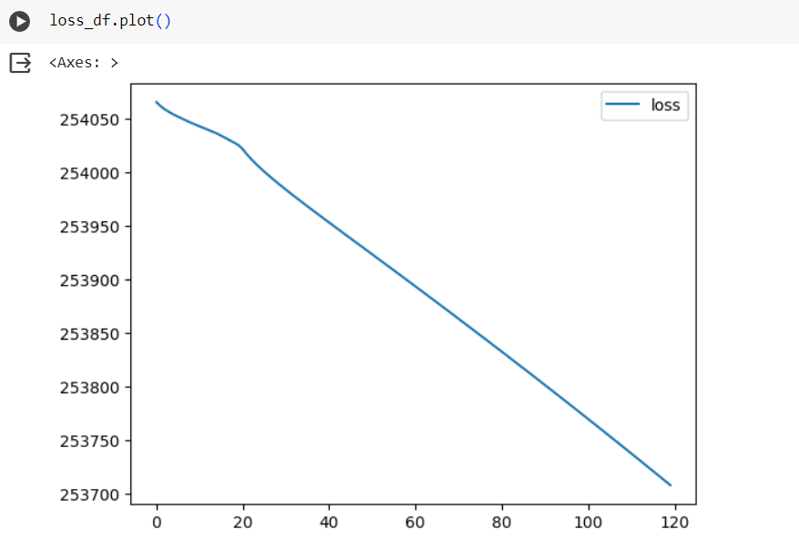
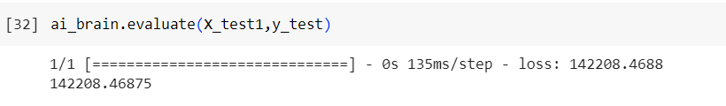
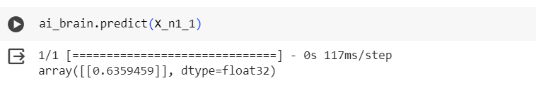

# Developing a Neural Network Regression Model

## AIM

To develop a neural network regression model for the given dataset.

## THEORY

A neural network is a computational model inspired by the structure and function of the human brain. It is a type of machine learning algorithm that processes information through interconnected nodes, known as neurons or artificial neurons. These neurons are organized into layers: an input layer, one or more hidden layers, and an output layer. In a neural network, each connection between neurons has an associated weight, and the network learns by adjusting these weights based on input data and desired output.

The model below has one input layer,The input layer receives the initial data or features for the neural network to process. Each node in this layer represents a specific feature of the input data.

There are 5 hidden layers in this model, making it a deep neural network. These hidden layers are responsible for learning complex patterns and representations from the input data. Each hidden layer consists of nodes, and the connections between these nodes have associated weights. These weights are adjusted during the learning process to enhance the network's ability to capture and generalize from the input data.

The output layer produces the final result or prediction. Each node in the output layer represents either a class (for classification tasks) or a continuous value (for regression tasks). The exact nature of the output depends on the specific requirements of the problem being addressed.


## Neural Network Model



## DESIGN STEPS

### STEP 1:

Loading the dataset

### STEP 2:

Split the dataset into training and testing

### STEP 3:

Create MinMaxScalar objects ,fit the model and transform the data.

### STEP 4:

Build the Neural Network Model and compile the model.

### STEP 5:

Train the model with the training data.

### STEP 6:

Plot the performance plot

### STEP 7:

Evaluate the model with the testing data.

## PROGRAM
```
DEVOLOPED BY : MADHAN BABU P
REGISTER NUMBER : 212222230075

import pandas as pd
from sklearn.model_selection import train_test_split
from sklearn.preprocessing import MinMaxScaler
from tensorflow.keras.models import Sequential
from tensorflow.keras.layers import Dense
from google.colab import auth
import gspread
from google.auth import default

auth.authenticate_user()
creds, _ = default()
gc = gspread.authorize(creds)

worksheet = gc.open('exccc').sheet1
data = worksheet.get_all_values()

dataset1 = pd.DataFrame(data[1:], columns=data[0])
dataset1 = dataset1.astype({'Input':'float'})
dataset1 = dataset1.astype({'Output':'float'})

dataset1.head(20)

X = dataset1[['Input']].values
y = dataset1[['Output']].values

X_train,X_test,y_train,y_test = train_test_split(X,y,test_size = 0.33,random_state = 33)

Scaler = MinMaxScaler()

Scaler.fit(X_train)

X_train1 = Scaler.transform(X_train)

from tensorflow import keras
from tensorflow.keras import layers


model = keras.Sequential([
    layers.Dense(units=1, input_shape=[3])
])

from tensorflow.keras.models import Sequential
from tensorflow.keras.layers import Dense

ai_brain = Sequential([
    Dense(units=4,activation = 'relu',input_shape=[1]),
    Dense(units=3,activation = 'relu'),
    Dense(units = 1)
])

ai_brain.compile(optimizer = 'rmsprop',loss='mse')
ai_brain.fit(X_train1,y_train,epochs = 120)


loss_df = pd.DataFrame(ai_brain.history.history)
loss_df.plot()

X_test1 = Scaler.transform(X_test)

ai_brain.evaluate(X_test1,y_test)

X_n1 = [[30]]

X_n1_1 = Scaler.transform(X_n1)
ai_brain.predict(X_n1_1)


```
## Dataset Information



## OUTPUT

### Training Loss Vs Iteration Plot



### Test Data Root Mean Squared Error



### New Sample Data Prediction



## RESULT
Thus we Develope a Neural Network Regression Model
